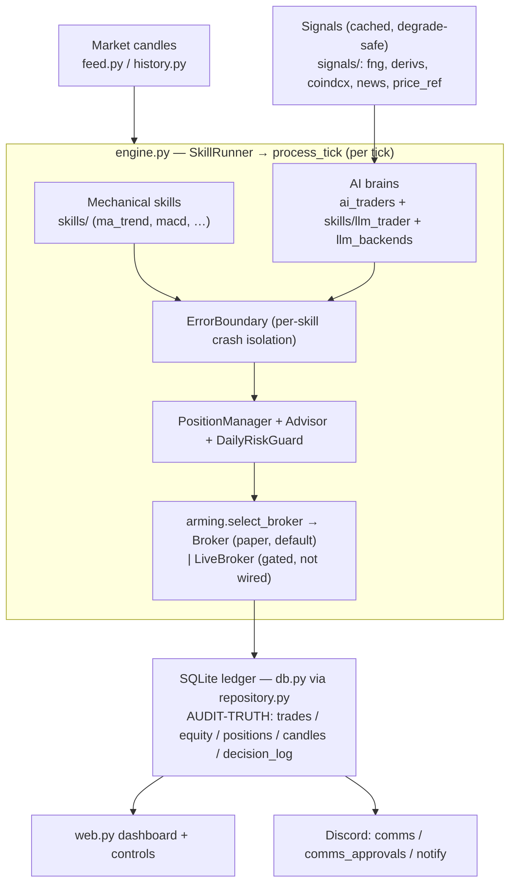
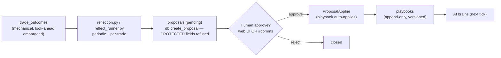
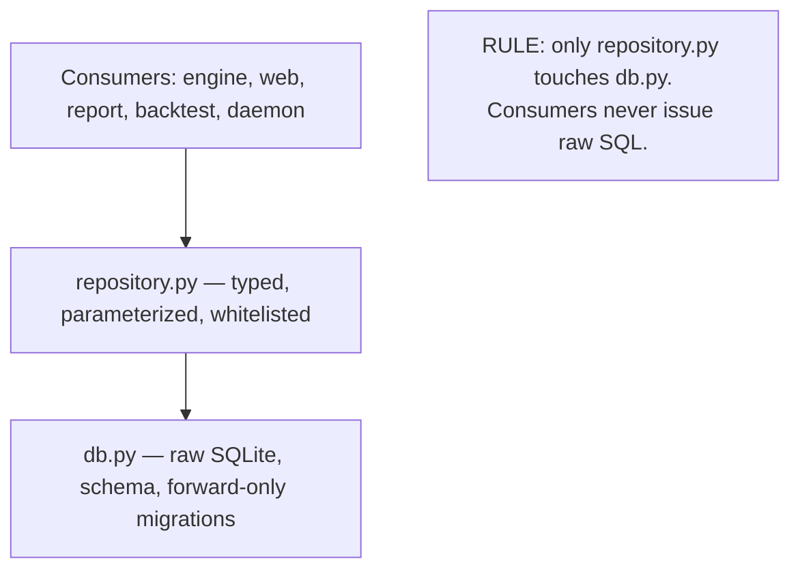
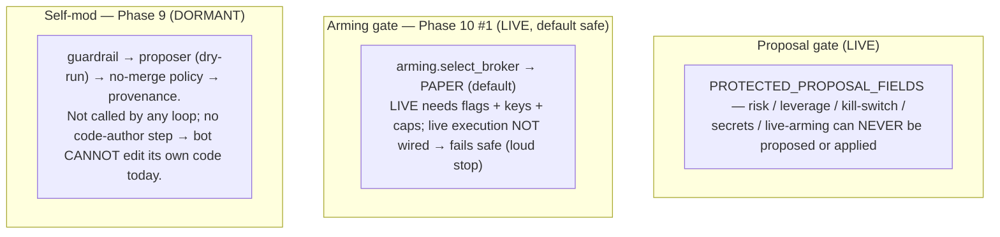

# ARCHITECTURE — homing-trade (a map for humans)

A high-level, **read-this-instead-of-the-code** overview: what each part does, where it lives, how
it's wired, and the safety gates. Pairs with `ROADMAP.md` (the plan/state) and the design specs in
`docs/superpowers/specs/`. Diagrams are Mermaid — they render on GitHub and in Linear.

> One-line mental model: **market data + signals → a roster of strategy "brains" decide → a gated
> broker executes (paper by default) → everything is written to an audit-truth SQLite ledger → the
> UI/Discord show it, and a human-gated learn→correct loop proposes improvements.**

## Module map (where things live)

| Layer | Modules (`homing_trade/`) | Responsibility |
|---|---|---|
| **Persistence** | `db.py`, `repository.py`, `ledger_base.py`, `ledger.py`, `models.py` | SQLite + forward-only migrations; `repository` is the ONLY thing that touches `db` (typed, whitelisted). `MemoryLedger` mirrors it for backtests. |
| **Execution core** | `engine.py`, `position_manager.py`, `broker.py`, `live_broker.py`, `arming.py`, `advisor.py`, `allocator.py`, `risk.py`, `error_boundary.py` | The per-tick loop (`SkillRunner`→`process_tick`); sizing/stops/liquidation; paper vs (gated) live broker; capital allocation; the daily risk guard/kill-switch; per-skill crash isolation. |
| **Strategy brains** | `skills/` (ma_trend, macd, bollinger, donchian, supertrend, zscore_revert, vol_breakout, ttm_squeeze, grid, rl_qlearn, committee, `llm_trader`), `ai_traders.py`, `llm_backends.py`, `llm_text.py` | Mechanical indicators + AI "brains". `ai_traders` builds AI brains from `AI_<NAME>_*` config; `llm_backends` is the cli/api/openai/… adapter layer. |
| **Signals / feeds** | `signals/` (fng, derivs, coindcx, news, price_ref, cache), `feed.py`, `history.py` | External market context (fear&greed, derivatives, orderbook, news, ref price), cached + degrade-safe; candle fetch/history. |
| **Learn → correct** | `reflection.py`, `reflect_runner.py`, `proposals.py`, `playbook_rollback.py`, `calibration.py`, `selfquery.py`, `metrics.py` | The autonomous loop: reflect over outcomes → file **proposals** (human-gated) → apply approved playbooks; confidence calibration; auto-rollback; read-only self-query + mechanical metrics. |
| **Backtest / eval** | `backtest.py`, `backtest_job.py`, `walkforward.py`, `experiments.py`, `promotion.py`, `profit_mirage.py`, `regime_filter.py`, `replay.py` | Honest walk-forward OOS evaluation, A/B experiments + stats, the promotion gate, the profit-mirage trust cutoff, the regime gate, and the deterministic decision replay/audit tool. |
| **Self-mod (Phase 9 — DORMANT)** | `self_modify.py`, `self_mod_proposer.py`, `self_mod_policy.py`, `provenance.py` | Safety scaffolding for the bot proposing CODE changes. **Built + tested but not wired to anything — see the safety-gates diagram.** |
| **Surfaces / ops** | `web.py`, `comms.py`, `comms_approvals.py`, `notify.py`, `daemon.py`, `supervisor.py`, `report.py`, `research.py` | Dashboard + controls + approval queue; two-way Discord (post/read + inbound approvals); alerts; always-on daemon + OS supervisor; reporting; research ingestion. |
| **Config / util** | `config.py`, `dotenv.py` | The ~50-field `Config` (+ env loader); `.env`/secret + CoinDCX-key reader. |

Checks run **locally** (`tools/check.sh` + the pre-push hook) — there is no CI.

## 1. System dataflow (one tick)

## 2. The learn → correct loop (LIVE — alters data, never code)

## 3. The persistence rule (one boundary)

## 4. Safety gates (what stops the bot doing something dangerous)

## Capability status (see ROADMAP for detail)
- **Live & working:** paper trading, full audit ledger, dashboard + always-on daemon, the
  learn→correct loop (human-gated), multi-AI brains, research ingestion, walk-forward eval,
  two-way Discord approvals (default-off), the replay/audit tool, per-skill crash isolation.
- **Gated / your call:** real money (Phase 10 — arming gate built; live execution #2 needs you).
- **Designed, not built:** human-in-the-loop live control (Phase 11), UI-native AI onboarding (Phase 12).
- **Dormant scaffolding:** self-altering CODE (Phase 9 modules exist, wired to nothing).
